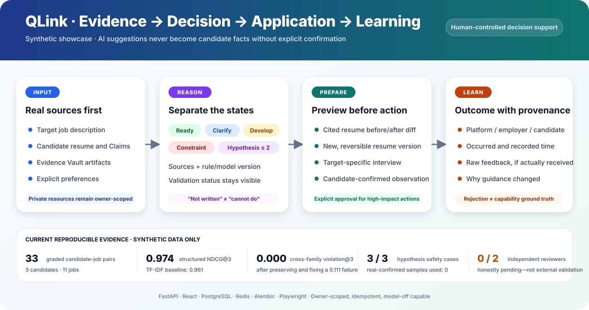

# QLink · Evidence-Grounded AI Job Workflow

> 基于真实经历、由用户控制的 AI 求职准备与招聘协作平台。<br>
> An evidence-grounded, user-controlled workflow for job preparation and hiring collaboration.

[五分钟项目案例 / Five-minute case study](./docs/PROJECT_CASE_STUDY.md) · [中文](#中文) · [English](#english) · [用户手册](./docs/USER_GUIDE.md) · [排序评测](./docs/EVALUATION.md) · [假设评测](./docs/HYPOTHESIS_EVALUATION.md) · [标注协议](./docs/RANKING_ANNOTATION_PROTOCOL.md) · [Agent 接入](./docs/AGENT_INTEGRATION.md) · [产品路线图](./R3_CONSOLIDATED_PRODUCT_AND_SCALE_PLAN.md)

[](./LICENSE)



---

## 中文

### QLink 是什么？

QLink 面向学生、应届生和工作 0–3 年的年轻求职者。用户导入真实简历和目标岗位 JD 后，系统把岗位要求与用户提供的经历、作品和证据关联起来，帮助用户判断机会、准备申请并练习面试。

QLink 的核心原则是：**AI 可以整理、建议和预填，但不能编造经历，也不能越过用户完成高影响操作。**

如果你只有五分钟，请直接阅读[项目案例：问题、架构、实验、失败修复与申请表达](./docs/PROJECT_CASE_STUDY.md)。

### 求职者主流程

```text
注册 → 上传真实简历 → 选择或导入目标 JD → 查看岗位准备度
    → 生成并确认简历版本 → 准备申请 → 结构化面试
    → 确认观察结果 → 跟踪申请状态
```

主要能力：

- 私有 JD 导入与所有权隔离；
- 当前、相邻、挑战三类职业方向探索；
- 岗位要求到候选人证据的映射；
- 五状态准备度：现在可用、需要说清、发展行动、现实约束、待验证假设；
- 面向目标岗位的简历建议和版本管理；
- 结构化 AI 面试与用户确认后的观察结果写回；
- 求职申请、澄清、邀请和状态记录；
- PostgreSQL、Redis、Worker、Scheduler、Nginx 组成的 Docker Compose 运行栈。

### 招聘方主流程

```text
受邀开通企业账号 → 发布或导入 JD → 确认岗位要求
               → 查看获授权的候选人 → 人工复核筛选结果
               → 请求澄清或邀请面试 → 更新申请状态
```

系统不做自动拒绝，不声称预测录用概率，也不使用学校或公司品牌作为隐性加分项。

### 三分钟本地启动

前置条件：Docker Desktop（包含 Docker Compose）。

```bash
cp .env.example .env
# 将 .env 中的 CHANGE_ME 替换为仅用于本地开发的安全值
make config
make up
```

打开 `http://localhost:8080`。使用 `http://localhost:8080/?demo=en` 可开启英文展示模式，使用 `?demo=off` 关闭。

- 存活检查：`/api/health`
- 就绪检查：`/api/ready`
- 管理员依赖诊断：`/api/admin/readiness`

未配置模型 Key 时，默认 `MODEL_REQUIRED=false`，应用会明确以 `rules_only` 模式运行，不会伪装模型服务已经就绪。

### 验收

```bash
make test          # 后端测试 + 前端测试、Lint 与生产构建
make evaluate-ranking # 离线复现固定排序评测集
make evaluate-hypotheses # 离线复现 C5 合成假设边界评测
make ps            # 查看服务状态
make logs          # 查看服务日志
make backup        # 备份数据库和上传文件
make down          # 停止服务并保留数据卷
```

进一步阅读：

- [用户手册（中英文）](./docs/USER_GUIDE.md)
- [安全、隐私与 AI 边界](./docs/SECURITY_AND_PRIVACY.md)
- [人工验收指南](./MANUAL_ACCEPTANCE_GUIDE.md)
- [公平性基线](./FAIRNESS_BASELINE_PROTOCOL.md)
- [排序评测、指标与失败案例](./docs/EVALUATION.md)
- [五分钟项目案例与申请展示证据](./docs/PROJECT_CASE_STUDY.md)
- [申请与面试表达（中英文）](./docs/APPLICATION_TALK_TRACK.md)
- [C6 经同意的真实用户试点协议](./docs/C6_PILOT_PROTOCOL.md)
- [独立复核标注协议](./docs/RANKING_ANNOTATION_PROTOCOL.md)
- [执行与验收报告](./R3_EXECUTION_AND_ACCEPTANCE_REPORT.md)

### 项目状态

QLink 当前是可运行的试点 Demo，不是已经上线的全功能 ATS。支付、发票、自动续费，以及经过授权的外部邮件和 ATS 结果集成仍在路线图中。自动填表与申请材料生成只能作为用户确认前的辅助；未经确认的自动投递不属于当前产品范围。

---

## English

### What is QLink?

QLink is an AI-assisted workflow for students, new graduates, and early-career candidates. A candidate brings a real resume and a target job description. QLink connects job requirements to candidate-provided experience and evidence, then helps the candidate evaluate the opportunity, prepare an application, and practice for interviews.

Its central rule is simple: **AI may organize, suggest, and prefill, but it must not invent experience or perform high-impact actions beyond the user's approval.**

If you have five minutes, start with the [project case study: problem, architecture, experiment, failure repair, and application framing](./docs/PROJECT_CASE_STUDY.md).

### Candidate journey

```text
Register → Upload a factual resume → Select or import a target JD
         → Review readiness → Confirm a tailored resume version
         → Prepare the application → Practice a structured interview
         → Confirm observations → Track application outcomes
```

The current platform includes private-JD ownership controls, career-direction exploration, requirement-to-evidence mapping, five-state readiness, resume suggestions and versioning, structured interviews, consent-gated observation writeback, application tracking, and a Docker Compose stack with PostgreSQL, Redis, workers, scheduling, and Nginx.

### Employer journey

```text
Join by invitation → Publish or import a JD → Confirm job requirements
                   → Review authorized candidates → Human-review screening
                   → Request clarification or invite → Update application state
```

QLink does not automate rejection, claim to predict hiring probability, or add hidden prestige scores for schools or former employers.

### Quick start

Prerequisite: Docker Desktop with Docker Compose.

```bash
cp .env.example .env
# Replace every CHANGE_ME value with a safe local-development value.
make config
make up
```

Open `http://localhost:8080`. Add `?demo=en` for the persistent English showcase mode and `?demo=off` to disable it.

Without a model API key, the default `MODEL_REQUIRED=false` configuration starts in an explicit `rules_only` mode. The application does not pretend that an AI provider is available.

### Verification

```bash
make test          # Backend tests + frontend tests, lint, and production build
make evaluate-ranking # Reproduce the fixed offline ranking evaluation
make evaluate-hypotheses # Reproduce the isolated C5 synthetic hypothesis checks
make ps            # Service status
make logs          # Service logs
make backup        # Database and upload backup
make down          # Stop services without deleting data volumes
```

Read the [bilingual user guide](./docs/USER_GUIDE.md), [five-minute case study](./docs/PROJECT_CASE_STUDY.md), [ranking evaluation and failure cases](./docs/EVALUATION.md), [hypothesis evaluation](./docs/HYPOTHESIS_EVALUATION.md), [C6 consented pilot protocol](./docs/C6_PILOT_PROTOCOL.md), [independent annotation protocol](./docs/RANKING_ANNOTATION_PROTOCOL.md), [security and privacy boundaries](./docs/SECURITY_AND_PRIVACY.md), [manual acceptance guide](./MANUAL_ACCEPTANCE_GUIDE.md), and [product roadmap](./R3_CONSOLIDATED_PRODUCT_AND_SCALE_PLAN.md).

### Project status

QLink is a runnable pilot Demo, not a production-wide ATS. Payment, invoicing, renewals, and authorized external email or ATS outcome integrations remain roadmap work. Form prefilling and application generation are user-reviewed assistance; unconfirmed automatic submission is outside the current product scope.

## Repository structure

```text
backend/app/       FastAPI routes, domain services, AI gateway, and data models
backend/tests/     Authorization, idempotency, matching, interview, and regression tests
frontend/src/      React pages, reusable components, API clients, and UI utilities
frontend/e2e/      Playwright full-chain browser tests
docs/              User, agent-integration, security, and privacy documentation
scripts/           Backup, restore, smoke-test, and acceptance scripts
```

## License / 许可证

The core platform is licensed under [GNU AGPL v3.0 only](./LICENSE). Organizations that require proprietary deployment, modification, or redistribution may request a separate commercial license; see [commercial licensing](./COMMERCIAL_LICENSE.md).

核心平台采用 [GNU AGPL v3.0-only](./LICENSE)。如企业需要闭源部署、修改或再分发，可以申请独立商业授权，详见[商业授权说明](./COMMERCIAL_LICENSE.md)。

Focused issues are welcome. Because QLink is preparing a dual-licensing path, external code contributions will be merged only after a compatible contributor agreement is published. Please read [CONTRIBUTING.md](./CONTRIBUTING.md) first.
