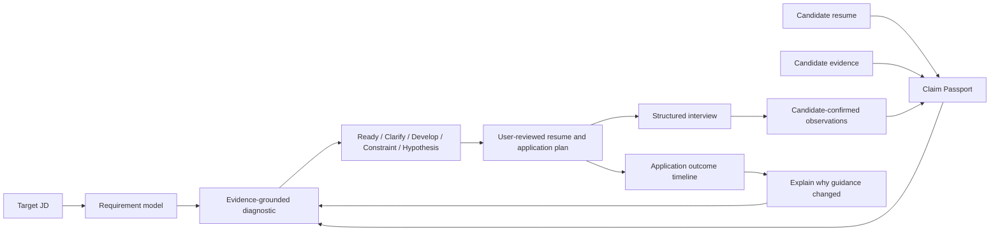

# QLink Five-Minute Case Study / QLink 五分钟项目案例

> Public portfolio artifact for engineering, data, fintech, responsible-AI, and emerging-leader applications. All examples below are synthetic; no real resume, applicant, or employer export is used.

## 30-second summary / 30 秒摘要


QLink is a runnable FastAPI + React decision-support system for early-career job seekers. It connects a target job description to candidate-provided experience and evidence, separates known facts from missing information, prepares a user-reviewed application and interview plan, and records outcomes without turning rejection into a capability label.

QLink 是一个可运行的 FastAPI + React 求职决策支持系统。它把目标岗位要求连接到候选人本人提供的经历与证据，把事实、信息缺口、现实约束和发展行动分开；申请材料、面试观察和站外结果都保留用户确认与来源边界。

The project question is not “Can AI assign a candidate one impressive score?” It is:

> How can a system help a person make a better career decision while keeping evidence, uncertainty, and consequential actions visible and under human control?

## Why this differs from a generic resume enhancer

LinkedIn provides useful patterns: a modular career profile, optional AI-assisted rewriting, and recommendations informed by profile and preferences. QLink adopts those interaction lessons but focuses on a different job:

| Pattern | QLink implementation | Boundary |
|---|---|---|
| Modular profile | Claim Passport + Evidence Vault + resume versions | Model output is not a candidate fact |
| Resume enhancement | Before/after preview with cited candidate sources | Explicit confirmation before a new version is saved |
| Job recommendations | Text baseline plus structured, preference-aware ranking | No hiring probability; no school/employer prestige score |
| Feedback loop | Application outcome timeline and “why guidance changed” | Rejection without feedback does not become a skill gap |
| Social connection | Deferred, limited mentor review after pilot evidence | No generic Feed, likes, or public contact graph in the MVP |

## System flow / 系统流程



The platform uses FastAPI, SQLAlchemy, PostgreSQL, Redis-backed background work, React, Playwright, Alembic migrations, Docker Compose, ownership checks, and idempotent writes. It also runs in an explicit `rules_only` mode when no model key is configured.

## Decision dimensions / 决策维度

QLink exposes dimensions instead of presenting one opaque human-quality score:

| Dimension | What the system may observe | What it must not infer |
|---|---|---|
| Skills match | Candidate text or confirmed Claim linked to a JD requirement | “Not written” = “cannot do” |
| Experience relevance | Tasks, methods, scope, and outcomes supplied by the candidate | Employer brand = quality |
| Education constraint | An explicit degree requirement and the candidate-provided degree level | School prestige or social status |
| Projects and evidence | Candidate-provided artifacts, links, work samples, and source spans | Unverified generated accomplishments |
| Evidence strength | Source availability, confirmation state, and conflicts | Truth certification or hiring probability |
| Missing information | At most two sourced, versioned hypotheses to clarify | A hidden negative score |

High-impact employer actions remain human reviewed. External submission and messaging require a user-visible preview and explicit approval.

## Synthetic end-to-end example / 合成端到端案例

**Target JD:** a backend role asking for Python, FastAPI, PostgreSQL, automated testing, and a clear explanation of individual contribution.

**Candidate-provided material:** a synthetic project describing a Python API and tests, but no Kubernetes experience and no supported percentage improvement.

**System behavior:**

1. links Python/API/testing requirements to candidate Claims;
2. marks Kubernetes as information to clarify, not a missing capability verdict;
3. proposes at most two validation hypotheses with source and rule version;
4. blocks unsupported numerical impact from the faithful rewrite;
5. lets the candidate confirm a before/after resume version;
6. carries the same evidence into a structured interview;
7. records only candidate-confirmed interview observations;
8. records an application outcome with source and timestamps;
9. explains why next-step guidance changed while preserving unchanged facts.

The repository’s Playwright core journey exercises the target-JD, evidence, preparation, and interview path against an isolated PostgreSQL + Redis stack.

## Ranking experiment / 排序实验

The fixed offline dataset contains three synthetic candidate queries, eleven synthetic jobs, and 33 graded pairs. It compares a deterministic TF-IDF/cosine baseline with the current structured, preference-aware ranker.

| Method | NDCG@3 | Recall@3 | Cross-family violation@3 | Unsupported negative judgment | Citation coverage |
|---|---:|---:|---:|---:|---:|
| TF-IDF + cosine | 0.961 | 0.889 | 0.000 | 0.000 | 0.818 |
| Structured human preference v3 | 0.974 | 0.778 | 0.000 | 0.000 | 1.000 |

These are small synthetic-set measurements, not hiring-effectiveness claims. Author labels are complete, but independent human review remains `pending 0/2`.

### A failure worth keeping

The first structured run placed a backend role in the Top 3 for a product query, producing a `0.111` cross-family violation rate. The sample was not deleted. The policy was changed to require at least two cited skill overlaps for an adjacent-family recommendation; the rerun reduced the measured violation to `0.000`.

TF-IDF still fails the documented preference-conflict stress case: after the candidate excludes finance, text similarity continues to rank a payments role. This remains visible because it demonstrates why text similarity alone is not a complete recommendation policy.

## What changed the ranking?

In the fixed counterfactual, only the synthetic candidate’s preferred industry changes from finance/technology to healthcare. Skills, experience, projects, and education stay unchanged.

- Before: payments backend → cloud platform → healthcare backend.
- After: healthcare backend → cloud platform.
- The payments and finance-analysis roles leave the visible set because the user excluded finance.

This explanation identifies the changed input. It does not rewrite a preference change as a new capability fact.

## Responsible-AI evidence / 负责任 AI 证据

- changing only synthetic names and school names leaves both evaluated rankings unchanged;
- private resumes, imported JDs, evidence, and hypotheses are owner scoped;
- hypotheses carry source, rule/model version, and validation status;
- confirming a hypothesis does not create a Claim or alter a resume;
- generated interview observations require candidate confirmation;
- no automatic rejection or hiring-probability claim;
- real-confirmed evaluation samples remain outside the checked-in synthetic pool;
- secret scanning, migrations, tests, production builds, and browser journeys are reproducible.

## Reproduce the evidence

```bash
make test
make evaluate-ranking
make evaluate-hypotheses
```

Detailed evidence:

- [Ranking evaluation and failure cases](./EVALUATION.md)
- [Independent annotation protocol](./RANKING_ANNOTATION_PROTOCOL.md)
- [Hypothesis evaluation and pool isolation](./HYPOTHESIS_EVALUATION.md)
- [Security, privacy, and AI boundaries](./SECURITY_AND_PRIVACY.md)
- [Manual acceptance guide](../MANUAL_ACCEPTANCE_GUIDE.md)
- [C6 consented pilot protocol](./C6_PILOT_PROTOCOL.md)
- [Application and interview talk track](./APPLICATION_TALK_TRACK.md)
- [Execution and acceptance report](../R3_EXECUTION_AND_ACCEPTANCE_REPORT.md)

## Contribution and AI-assistance statement

This project was built through human-directed, AI-assisted development. Product scope, safety invariants, acceptance criteria, and release decisions remain human responsibilities. AI tools assisted with implementation, test generation, debugging, and documentation; their output was reviewed against repository tests and explicit product invariants. The project does not present AI-assisted code as unaided manual work.

For an application or interview, the maintainer should describe only work they can personally explain and defend: the product decision, architecture trade-off, failure diagnosis, code path, test evidence, and remaining limitation.

## Honest current status and next experiment

Completed engineering evidence includes the runnable Demo, evidence-grounded workflow, ranking comparison, counterfactual checks, hypothesis isolation, migrations, regression tests, and browser journeys.

Not yet complete:

- two independent reviewers must blind-label the 33 ranking pairs;
- the [consented C6 pilot protocol](./C6_PILOT_PROTOCOL.md) is ready, but recruitment must test whether real users reach a useful output faster and return within seven days;
- there is no evidence yet for a general social graph, Feed, or autonomous application submission;
- the project has not demonstrated real-world hiring lift and does not claim it.

This makes the next leadership task concrete: recruit reviewers and pilot users, publish the protocol and limitations, learn from disagreements, and make a Go / Iterate / Stop decision from real evidence.

## Application framing / 申请表达

- **Problem:** early-career candidates cannot tell which real experiences support a role.
- **Decision:** separate evidence, uncertainty, constraints, and development actions.
- **Build:** a full-stack workflow with ownership, consent, idempotency, auditability, and model-off degradation.
- **Evaluate:** compare baselines, measure relevance and failure modes, and keep counterfactual and citation checks reproducible.
- **Learn:** model outputs and incomplete hiring outcomes are not clean human ground truth.
- **Lead:** turn the system into a transparent pilot, invite independent review, and act on measured disagreement.

For Goldman Sachs Emerging Leaders Series, verify the current cohort and graduation-date requirements on the [official program page](https://www.goldmansachs.com/careers/students/programs-and-internships/americas/emerging-leaders-series) before applying. If the cohort is not eligible, the same evidence is reusable for engineering, data, fintech, responsible-AI, entrepreneurship, and other leadership applications without changing the product into a one-program project.
